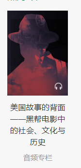

# 星球大战css3特效开发

- 能力增长点
    学习的目的在于不断设计能力增长点
    1. hackthon 黑客精神
    2. html/css/js 离开api 
        - html结构
            emmet 快速完成 热门专栏写法变了 作业
    3. markdowm 语法格式
        
    4. css 基础
    [css animation](https://www.w3school.com.cn/cssref/pr_animation.asp)
- 学习愿景
    极大的学习愿景
    代码世界的导演 ,html/css/js
    1. 图片 演员
        背景图片 bg repeat
        star 图片
        wars 图片
    2. 布局
        定位到相应的地方
        css
        css 动画
        - 居中做法
            1. 先绝对定位，以中心点作为左上角 position
            2. 向左移自身宽度的一半，向上移自身高度的一般 transform
    3. 结构及体验
        跟电影一模一样的效果
- 开发素养
    1. 工具思维
    2. 落伍的操作
        - emmet
            快，emmet使用css选择器来达到快速输出html的能力
            - > 选择子元素
            - + 兄弟节点
            - div 可以省略
            - [] 属性选择器
        - 文件访问方式
            document
            网络访问 
            本地 127.0.0.1
            外网 买个域名
        - css 使用背景调试法
        